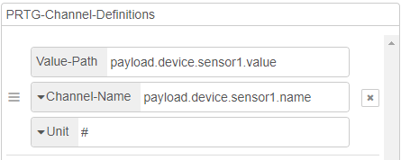

# node-red-contrib-prtg
node-red nodes to interact with PRTG Network Monitor

## Installation:
    npm i git+https://github.com/PaesslerAG/node-red-contrib-prtg.git

## PRTG nodes:

The prtg-connector node transforms a message payload to the format for custom sensors in PRTG and sends an HTTP POST request to the probe system with the configured HTTP Push-based sensor in PRTG. The IP address or DNS name and the Identification Token used for the sensor need to be configured in the prtg-connector node.

## Configuration

**Enter the server and port for the connection to PRTG:**

**Add the Identification Token of the configured sensor in PRTG:**

**Example of a channel definition for PRTG:**

    Value Path
        Enter the path to the channel value in your input message payload.
    
    Channel Name
        The name of your Channel in PRTG

    Unit
        Enter the custom channel unit name for the according channel.
        This can be a static string or a placeholder.

## Collaborate
### Commit message format:
    <type>(<scope>): <subject>

    types:

    feat: A new feature
    fix: A bug fix
    docs: Documentation only changes
    style: Changes that do not affect the meaning of the code (white-space, formatting, missing semi-colons, etc)
    refactor: A code change that neither fixes a bug nor adds a feature
    test: Adding missing or correcting existing tests
    chore: Changes to the build process or auxiliary tools and libraries such as documentation generation

    As scopes we use the node-name or *

    Example: feat(prtg-connector): added a new field to the nodes settings

